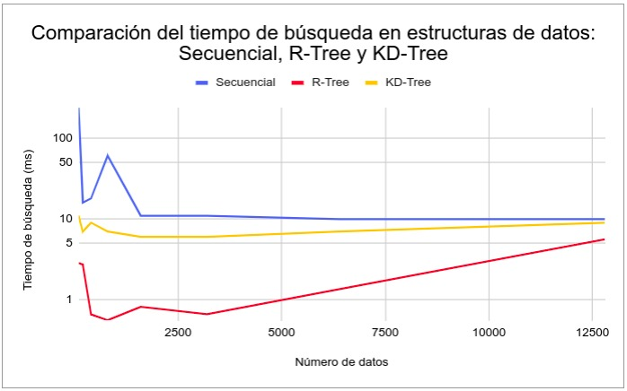

# DB2-third-project

# Steps for go into the project
- Clone the repo
  - gh repo clone Br4yanGC/DB2-third-project
- Move into the backend folder
  - cd Br4yanGC/DB2-third-project/backend   
  - pip install -r requirements.txt
- Move into the frontend folder
  - cd Br4yanGC/DB2-third-project/fronted
  - npm install

Also, you will need to add some files
- Backend
  - KD-TREE.csv
  - feature_vectors.json
- Frontend
  - src/assets/lfw/

- Starting the frontend and backend
  - npm run dev (you should move to the frontend folder before running the command)
  - python server.py (you should move to the backend folder before running the command)

# Note
- Don't click the button on the http://localhost:5173/knn-kdtree-knn-search-live route. We will run the knn-search-live by console due to some difficulties

# Resumen
El presente proyecto tiene como objetivo desarrollar un sistema de búsqueda y recuperación de información basado en el contenido, con un enfoque específico en el reconocimiento facial. Este sistema de reconocimiento facial funcionará mediante la captura del rostro de una persona en una imagen o en tiempo real, que posteriormente será procesada para extraer su vector característico. Dicho vector se comparará luego con otros vectores derivados de una base de datos de rostros para retornar aquellos con los que presenta una mayor coincidencia. Para el cumplimiento de este objetivo, el proyecto integrará estructuras multidimensionales que permitan dar soporte a la búsqueda y recuperación eficiente de imágenes y luego comparará su rendimiento.

# Dominio de datos
Se hizo uso de un [dataset](http://vis-www.cs.umass.edu/lfw/) de referencia con más de 13 mil imágenes de rostros de personas. Algunas personas tienen más de una imagen asociada, se consideraron todas.

# Librerías
## Face Recognition
Se utilizó esta librería para la extracción de características de los rostros identificados en las imágenes, ya que, la librería face_recognition proporciona una serie de técnicas ya implementadas para adquirir una representación compacta y representativa de cada rostro (encoding). 

Esta librería utiliza técnicas basadas en el aprendizaje profundo (deep learning) para generar un vector característico de 128 dimensiones para cada rostro. Esta representación vectorial se ha demostrado efectiva para el reconocimiento de rostros con una muy alta precisión del 99.38%.

Para el presente proyecto se utilizaron las siguientes funciones básicas de la librería:
- **load_image_file**: Para cargar una imagen desde un archivo para su posterior procesamiento.
- **face_encodings**: Para generar un vector característico de 128 dimensiones para cada rostro detectado en una imagen.
- **face_locations**: Para identificar las ubicaciones de los rostros en una imagen, devolviendo las coordenadas del cuadro delimitador de cada rostro. Esta función se utilizó para el reconocimiento facial en tiempo real. 

## RTree
La librería RTree es una implementación de la estructura de datos espaciales R-tree. Los R-trees son árboles de búsqueda balanceados, similares a los B-trees, pero se utilizan para sistemas de datos espaciales y multidimensionales. En el presente proyecto se utiliza esta librería para acelerar las búsquedas KNN y por rango. Dado que estas operaciones pueden ser muy costosas en términos de tiempo de cálculo si se hicieran utilizando una búsqueda secuencial, puesto que requerirían de un tiempo proporcional al tamaño del conjunto de datos, lo que puede ser muy lento si el conjunto de datos es grande.

En cambio, si se utiliza un R-tree para indexar los vectores característicos de las imágenes, se pueden encontrar las imágenes más similares a la imagen de consulta mucho más rápido. Dado que en lugar de tener que calcular la distancia a cada vector característico, se puede navegar rápidamente por el árbol para encontrar las regiones del espacio de características que están cerca del vector de la imagen de consulta. Esto permite eliminar rápidamente las regiones del espacio de características que están lejos del vector característico de la imagen de consulta, lo que reduce significativamente el número de cálculos de distancia que se tienen que realizar.

## Sklearn: KD-Tree
A medida que la dimensión del espacio aumenta, el rendimiento de los R-trees y otras estructuras de datos de índice espacial puede degradarse debido a la "maldición de la dimensionalidad". En ese sentido, para el presente proyecto hicimos uso de una estructura de datos llamada KD-Tree para evaluar su rendimiento en altas dimensiones respecto al de los otros métodos utilizados.

En Python, la librería Scikit-learn (sklearn) proporciona una implementación de KD-Tree en su módulo neighbors.

Un KD-Tree, o árbol k-dimensional, es una estructura de datos particionada por espacio utilizada para organizar puntos en un espacio k-dimensional. Los KD-Trees son útiles para una variedad de aplicaciones, como la búsqueda de vecinos más cercanos, que es lo que se implementó en el presente proyecto.

# Backend
## Procesamiento de los datos
Al correr el programa por primera vez es necesario procesar todas las imágenes del dataset para extraer sus vectores característicos y almacenarlos en memoria secundaria, para ello, se llaman a las funciones `process_dataset` y `load_to_memory`:

La función `process_dataset` opera en un conjunto de imágenes organizadas en subcarpetas por persona dentro de la carpeta dataset. Para cada imagen, la función utiliza la librería `face_recognition` para generar el vector característico del primer rostro detectado. Este vector se guarda en un diccionario (**image_dict**) donde el _key_ es el nombre de la subcarpeta e imagen, y el valor es el vector característico del rostro. Cada 1000 imágenes procesadas, se llama a la función `load_to_memory` para guardar los vectores característicos en el archivo **feature_vectors.json** y liberar **image_dict**.

```py
def process_dataset():
    counter = 0
    dataset = os.path.join(cwd, "dataset")
    dataset_listdir = os.listdir(dataset)
    image_dict = {}
    for person_folder in dataset_listdir:
        person_folder_path = os.path.join(dataset, person_folder)
        person_folder_listdir = os.listdir(person_folder_path)
        for image in person_folder_listdir:
            image_path = os.path.join(person_folder_path, image)
            face = face_recognition.load_image_file(image_path)
            face_encoding = face_recognition.face_encodings(face)
            key = person_folder + "/" + image

            if len(face_encoding) != 0:
                new_face_encoding = tuple(face_encoding[0])
                image_dict[key] = str(new_face_encoding)
                counter += 1
                if counter % BLOCK_SIZE == 0:
                    load_to_memory(image_dict)
            else:
                print("\nNo face was found in: " + str(image_path))        
    load_to_memory(image_dict)
```
```py
def load_to_memory(image_dict):
    processed_path = os.path.join(cwd, "feature_vectors.json")
    try:
        with open(processed_path, 'a', encoding="utf-8") as file:
            for keyword in image_dict:
                file.write(json.dumps({keyword: image_dict[keyword]}, ensure_ascii=False))
                file.write("\n")
            file.close()
            print("\nBlock uploaded")
        image_dict.clear()
        return 1
    except IOError:
        print("\nProblem reading: " + str(processed_path))
        return 0
```

## Indexación y Búsqueda
### Secuencial
* **Búsqueda por rango.**
La función `range_search` en primer lugar, calcula el encoding de la imagen de consulta utilizando la librería `face_recognition`.
```py
face = face_recognition.load_image_file(image_path)
face_encoding = face_recognition.face_encodings(face)
```
Posteriormente, calcula la distancia euclediana con `numpy.linalg.norm` entre el vector característico del primer rostro identificado de la imagen y cada codificación de rostros almacenada en **block_dictionary**. 
```py
for path in block_dictionary:
    first = numpy.array(list(map(float, block_dictionary[path].strip("()").split(', '))))
    second = numpy.array(list(map(float, new_face_encoding[0])))
    distance = numpy.linalg.norm(first - second)
```
Finalmente, almacena las entradas de **block_dictionary** para las cuales esta distancia es menor que el radio de consulta en la lista **result**.
```py
if distance < radius:
    result.append((path, distance))
```
* **Búsqueda KNN.**
La función `knn_search` opera de igual forma a la función `range_search` , a diferencia de que en esta función se utiliza una cola de prioridad para almacenar las distancias.
```py
pq = PriorityQueue(False)
for path in block_dictionary:
    first = numpy.array(list(map(float, block_dictionary[path].strip("()").split(', '))))
    second = numpy.array(list(map(float, new_face_encoding[0])))
    distance = numpy.linalg.norm(first - second)
    person = path
    item = (person, round(distance,3))
    pq.put(CustomItem(item))
```
Finalmente, la función extrae los `k` elementos de menor distancia de la cola de prioridad en la lista **result**.
```py
for i in range(k):
    result.append(pq.get().item)
```

### RTree
En la clase `Indexacion_Busqueda` ubicada en el archivo `main.py` se definen las propiedades del R-tree a implementarse, así como los elementos con los que será llenado, que en este caso son todos los vectores característicos derivados de la base de datos de rostros almacenados en el archivo **feature_vectors.json**. Para cargar estos vectores a la memoria RAM, se utiliza la función `load_block_dictionary`.

```py
def __init__(self):
        if (len(self.block_dictionary) == 0):
            self.block_dictionary = load_block_dictionary(self.block_dictionary, self.total)
        p = index.Property()
        p.dimension = 128
        p.buffering_capacity = 4
        p.dat_extension = 'data'
        p.idx_extension = 'index'
        self.idx128d = index.Index('128d_index', properties=p)
        self.KNN_RTree = knn_rtree(self.idx128d, self.block_dictionary, self.indexed_dictionary)
```
Luego, la clase `knn_rtree`, se inicializa insertando los vectores característicos en el RTree **idx128d** llamando a `self.idx128d.insert(counter, val)`. La variable **counter** de la forma: 1,2,3,..., actúa como un identificador (_key_) para cada vector en el R-tree. Esta variable también es utilizada para mapear el key inicial de cada vector, que es el _path_ de cada imagen procesada (**item[0]**) junto a su vector, en el diccionario **indexed_dictionary**, ello con el objetivo de facilitar las operaciones posteriores de búsqueda.

```py
def __init__(self, p, BD, ID):
        self.idx128d = p
        self.block_dictionary = BD
        self.indexed_dictionary = ID

        items =  list(self.block_dictionary.items())
        counter = 1
        for item in items:
            val = tuple(numpy.array(list(map(float, item[1].strip("()").split(', ')))))
            self.idx128d.insert(counter, val)
            self.indexed_dictionary[counter] = (str(item[0]), val)
```

* **Búsqueda KNN.**
La función `knn_search_rtree` en primer lugar, calcula el encoding de la imagen de consulta utilizando la librería `face_recognition`.
```py
face = face_recognition.load_image_file(image_path)
face_encoding = face_recognition.face_encodings(face)
```
Luego, llama a la función `nearest` para obtener las _key_ de los K vectores más cercanos en el R-tree.
```py
new_face_encoding = tuple(face_encoding[0])
KNNvalue = list(idx.nearest(coordinates=new_face_encoding, num_results=K))
```
Después de obtener los índices, se calcula la distancia euclidiana con `numpy.linalg.norm` entre el vector característico del rostro de la imagen de consulta y cada uno de los K vectores de los rostros más cercanos encontrados. Finalmente, se almacenan estas distancias junto con el _path_ de la imagen correspondiente en la lista **result**.
```py
for idx in KNNvalue:
    item = indexed_dictionary[idx]
    path = item[0]
    first = numpy.array(item[1])
    second = numpy.array(new_face_encoding[0])
    distance = numpy.linalg.norm(first - second)
    result.append((path, round(distance, 3)))
```

* **Búsqueda por rango.**
Al igual que la función `knn_search_rtree`, la función `range_search_rtree` primero calcula el encoding (vector característico) del rostro identificado en la imagen de consulta. Posteriormente, para cada punto en esta codificación, se definen los límites inferior y superior a partir del radio de consulta. La variable **bound** se crea al concatenar los `limite_inferior` y `limite_superior` de cada punto, y define la región del espacio de búsqueda (MBR).
```py
for point in new_face_encoding:
    limite_inferior.append(point - radius)
    limite_superior.append(point + radius)
bound = limite_inferior + limite_superior
```
Posteriormente, se utiliza la función `intersection` para obtener todos los índices de los objetos almacenados en el RTree que intersectan con el MBR.
```py
range_values = [n for n in idx.intersection(bound)]
```
Luego, para cada índice en **range_values**, primero se obtiene su encoding correspondiente en **indexed_dictionary**. Después de ello, se calcula la distancia entre este encoding y el de la imagen de consulta. Si esta distancia es menor que el **radius** y el _path_ de esta imagen no es el mismo que el de la imagen anterior, la imagen se agrega a la lista de resultados.
```py
second = numpy.array(new_face_encoding[0])
for idx in range_values:
    item = indexed_dictionary[idx]
    path = item[0]
    first = numpy.array(item[1])
    dist = numpy.linalg.norm(first - second)
    if dist < radius and path != previous_path:
        result.append((path, round(dist, 3)))
    previous_path = path
```
### KD-Tree
* **Búsqueda KNN.**
Al llamar a la función `kdtree` por primera vez, se crea el archivo **KD-TREE.csv** con el objetivo de optimizar la carga de los datos en la estructura KDTree. Para este proceso, en primer lugar, se convierte en un dataframe a las representaciones vectoriales de las imágenes almacenadas en **block_dictionary** junto al _path_ de cada una (última columna).
```py
col = [str(i) for i in range(128)]
temp1 = pd.DataFrame(columns=col)
img = pd.DataFrame(columns=["img"])
for path in block_dictionary:
    first = numpy.array(list(map(float, block_dictionary[path].strip("()").split(', '))))
    first = pd.DataFrame(first.reshape(1,-1), columns=list(col))
    temp1 = pd.concat( [temp1, first]) 
    second = pd.DataFrame(numpy.array([path]), columns=["img"])
    img = pd.concat([img,second])
temp1["img"] = img
temp1.to_csv(cwd+'/KD-TREE.csv',index=False, encoding='utf-8')    
```
Una vez creado el archivo **KD-TREE.csv** se llama a la función `KDTree` para construir la estructura de datos multidimensional a partir del dataframe. Posteriormente, se utiliza la función `query` que devuelve dos valores: las distancias a los `k` vecinos más cercanos al encoding del rostro identificado en la imagen de consulta (previamente calculado con la librería `face_recognition`) y los índices de estos vecinos. Finalmente, el programa devuelve este resultado en una lista de tuplas. 
```py
tree = KDTree(temp1.iloc[:, 0:-1])
time1 = time.time()
dist, ind = tree.query(face_encoding,k)
time2 = time.time()
result = []
for i in range(len(dist[0])):
    result.append((temp1.iloc[ind[0][i]].values.tolist()[-1], round(dist[0][i],3)))
```
# Fronted
# Experimentación y análisis de los resultados
Se ejecutó el KNN-secuencial, KNN-RTree y el KNN-KD-Tree sobre una colección de objetos de tamaño N con el objetivo de compararar la eficiencia en función del tiempo de ejecución. Para todos los casos se mantuvo el valor de k=8.
Los resultados fueron los siguientes:

|   N    | Secuencial | R-Tree | KD-Tree |
|--------|------------|--------|---------|
|  100   |    240     | 2.857  |   11    |
|  200   |     16     | 2.736  |   7     |
|  400   |     18     | 0.658  |   9     |
|  800   |     61     | 0.556  |   7     |
| 1600   |     11     | 0.817  |   6     |
| 3200   |     11     | 0.662  |   6     |
| 6400   |     10     | 1.351  |   7     |
| 12800  |     10     | 5.603  |   9     |



Al analizar la gráfica, podemos observar que la búsqueda secuencial tiene un tiempo de búsqueda relativamente constante a medida que el tamaño de los datos (N) aumenta. Algunos de los picos inesperados en el rendimiento de la búsqueda secuencial como para N=100 y N=800 puede deberse a la inestabilidad de la máquina o la carga de trabajo del sistema al momento de ejecutar el algoritmo, por lo que el problema se podría mitigar al repetir el experimento más veces y tomar un promedio de las pruebas.

Por otro lado, se puede observar una ligera mejora en los tiempos de búsqueda para el KD-Tree y una mejora aún mayor para el R-Tree, sin embargo, en ambos casos, se observa una tendencia creciente a medida que el tamaño de los datos (N) aumenta, efecto que puede explicarse bajo el concepto de **"la maldición de la dimensionalidad"** que refiere a los problemas que surgen cuando se trabaja con datos de alta dimensión en espacios multidimensionales. Es decir, los algoritmos de búsqueda como el R-Tree o KD-Tree pueden volverse ineficientes ya que el número de combinaciones posibles de datos aumenta exponencialmente con cada dimensión adicional, de manera que por ejemplo, si los datos tienen muchas características, entonces la eficiencia de estas estructuras puede disminuir, ya que, la distancia entre los puntos se vuelve menos significativa.
